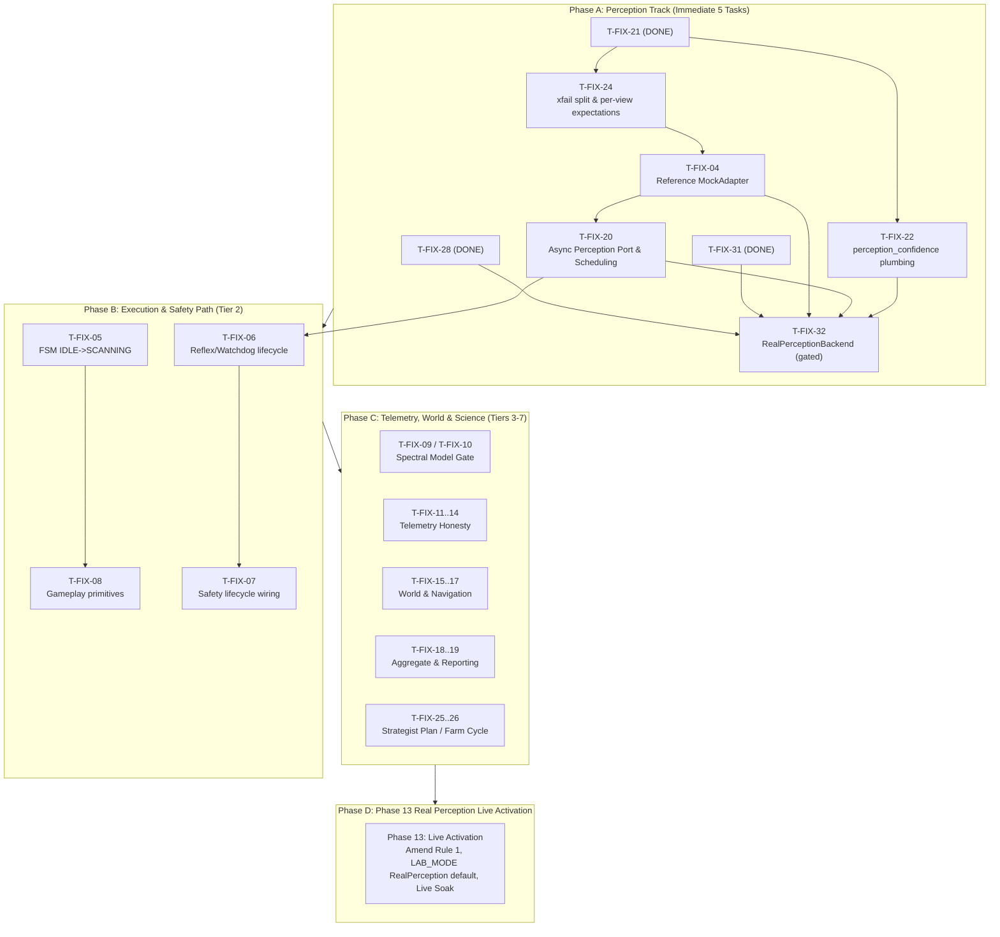

# Pre-Real-Perception Roadmap Completion & Real Perception Implementation Plan

## Goal Description

Investigate the state of `master` after `T-FIX-31` (commit `70ec219`), analyze the remaining tasks on `docs/lab_phase/PRE_REAL_PERCEPTION_FIX_ROADMAP.md` and `docs/lab_phase/HAMBERGER_PORT_PLAN.md`, and lay out the execution sequence to complete the pre-real-perception requirements and implement the real perception stack up to Phase 13 live readiness.

---

## 1. Investigation Findings & Current State

### 1.1 Git Commit Baseline
The current `HEAD` of branch `master` is commit [`70ec219`](file:///c:/Users/puria/Desktop/code-workshop/projects/WoW-bot) (*"T-FIX-31"*).
The working tree is clean with zero uncommitted changes.

### 1.2 Status of T-FIX-31
`T-FIX-31` (*UI panel channels*) was completed and merged in `70ec219`. It added:
- `perception/bag.py`: Bag frame template match & slot counts.
- `perception/xp.py`: XP bar fill and level OCR.
- `perception/durability.py`: Character frame durability OCR.
- `perception/cast.py`: Enemy cast bar & spell extraction.
- `perception/loot.py`: Sparkle color dominance (`LOOT_CHANNEL_MEASURED=False` fail-closed).
- `perception/_ocr.py`: Shared OCR tokenization & confidence logic.
- `perception/panels.py`: Composition site (`PanelReaders`, `PanelObservations`).
- `config/perception.example.toml` & `config/lab.example.toml`: Configuration blocks.
- 63 unit tests in `tests/test_perception_panels.py` and 4 in `tests/test_perception_config.py`.

*(Documentation sync note: `docs/lab_phase/PRE_REAL_PERCEPTION_FIX_ROADMAP.md` line 137 and 2085 still record T-FIX-31 with the pre-commit marker `DONE*`, which will be synchronized to `DONE (commit 70ec219)`).*

### 1.3 Test & Static Analysis Baseline
- **Ruff**: Clean (`ruff check src tests scripts` → `All checks passed!`).
- **Mypy**: Clean (`mypy src` → `Success: no issues found in 138 source files`).
- **Perception tests**: 346 passed, 1 expected `xfailed` (`test_canonical_game_state_end_to_end_projection` in `tests/test_perception_adapter.py`, targeted by `T-FIX-24`).
- **Full test suite**: 2552 passed, 7 skipped, 1 xfailed, 1 failed (the pre-existing baseline spectral acceptance gate in `test_spectrum.py`, owned by `T-FIX-10`).

---

## 2. Roadmap Architecture & Phased Execution

To achieve the user's objective—completing the pre-real-perception roadmap and the real perception implementation itself—the work is organized into 4 distinct phases:



---

## 3. Deep Dive: Phase A (The 5 Immediate Perception Tasks)

These 5 tasks finish the perception stack, unblock end-to-end projection, bridge async perception to the lab runner, and assemble `RealPerceptionBackend`.

### Step 1: `T-FIX-24` — Per-view projection expectations (xfail split)
- **Status:** PENDING
- **Dependencies:** T-FIX-21 (DONE)
- **Scope:** `tests/test_perception_adapter.py`
- **Objective:**
  - Replace the single `@pytest.mark.xfail(strict=True)` test (`test_canonical_game_state_end_to_end_projection`) with 8 explicit named tests, one per consumer view.
  - Assert that unblocked views (`to_world_sync_view`, `to_targeting_views`, `to_reactive_view`, `to_flee_view`) project without raising when supplied with valid context.
  - Assert that blocked views raise `AdapterIncompleteError` naming the exact missing field (`resource_max` for StrategistView and CombatView; `target_is_lootable` for LootView; `inventory_count` for VendorView).
  - Eliminate the `xfail` marker so `tests/test_perception_adapter.py` is 100% green without caveats.
- **STRATEGY A Exception:** Not required (test file only).

### Step 2: `T-FIX-22` — perception_confidence plumbing and thresholding
- **Status:** PENDING
- **Dependencies:** T-FIX-03.6 (DONE), T-FIX-21 (DONE)
- **Scope:**
  - `src/wow_bot/mocks/mock_perception.py` (populate confidence map, emit low-confidence `None` on select frames)
  - `src/wow_bot/perception/adapter.py` (apply `AdapterConfidenceConfig`: below-threshold fields degrade to `None`)
  - `config/lab.example.toml` & `config/perception.example.toml` (confidence threshold keys with comments)
  - `tests/test_perception_confidence.py` (or added to `test_perception_adapter.py`)
- **Key Invariants:**
  - An absent key in `perception_confidence` means "not attempted" (leaves value intact if valid).
  - A key with confidence below threshold degrades that field to `None` (fail-loud on non-optional view fields).
  - An observed zero (e.g., `inventory_count == 0` with high confidence) is preserved and never converted to `None`.
- **STRATEGY A Exception:** **Required** for `mocks/mock_perception.py` in `AGENTS.md` §5 (re-opening file closed after §5.6).

### Step 3: `T-FIX-04` — Reference MockAdapter
- **Status:** PENDING
- **Dependencies:** T-FIX-03.6, T-FIX-21, T-FIX-24
- **Scope:**
  - `src/wow_bot/perception/mock_backend.py`: implement `MockPerceptionBackend(PerceptionBackend)` wrapping `MockPerception.get_state()` as `async def snapshot(self) -> GameState`.
  - Simplify `_make_well_formed_state` in `tests/test_perception_adapter.py` (remove redundant `object.__setattr__` monkeypatching).
  - Add mock scenario exercising `target.hp_pct == 0.0` to verify `target_is_alive` derivation in both polarities.
  - End-to-end integration tests: `MockPerceptionBackend.snapshot() -> GameStateAdapter -> Views`.
- **Acceptance:**
  - `isinstance(MockPerceptionBackend(...), PerceptionBackend)` is True.
  - All 8 views asserted cleanly.
- **STRATEGY A Exception:** Not required (`perception/` is not frozen).

### Step 4: `T-FIX-20` — Async perception port and loop scheduling
- **Status:** DONE
- **Dependencies:** T-FIX-04
- **Scope:**
  - `src/wow_bot/perception/port.py`: implemented `PerceptionPort` owning a background `snapshot()` polling loop and exposing synchronous `sample() -> GameState` for the runner's slot.
  - Bounded runner update in `src/wow_bot/lab/runner_v2.py`: accepts `PerceptionBackend` / `PerceptionPort` alongside existing synchronous callable.
  - Ensured fast reflex loop is not blocked by slow navigation or `time.sleep` with `_CancellableSleep` and cooperative task yielding.
  - `config/lab.example.toml`: `snapshot_staleness_ms` config option documented.
  - Tests covering async pump, staleness detection, cancellation, and backward compatibility in `tests/test_perception_port.py`.
- **STRATEGY A Exception:** Granted via `AGENTS.md` §5.8.

### Step 5: `T-FIX-32` — RealPerceptionBackend (gated)
- **Status:** PROPOSED (Ratify)
- **Dependencies:** T-FIX-28, T-FIX-31, T-FIX-04, T-FIX-20, T-FIX-22
- **Scope:**
  - `src/wow_bot/perception/real_backend.py`: implement `RealPerceptionBackend(PerceptionBackend)`.
  - Wires:
    - Capture (`ScreenCapture`)
    - Readers: `BarReader`, `CombatDetector`, `TargetReader`, `EnemyDetector`, `MinimapTracker`, `EventDetector`
    - Addon channels: `PoseReader`, `ProximityReader`, `ReactionReader` (`InjectedObservations`)
    - UI panel channels: `BagReader`, `XPReader`, `DurabilityReader`, `CastReader`, `LootReader` (`PanelObservations`)
    - State builder: `RealStateBuilder.build(...)`
  - Integration tests feeding synthetic/recorded frame suites through `RealPerceptionBackend.snapshot()`.
  - Gate: Ensure `RealPerceptionBackend` is **never the default producer** in either `MOCK_MODE` or `LAB_MODE` until Phase 13 formal activation.
- **STRATEGY A Exception:** Not required (`perception/` is not frozen).

---

## 4. Phase B & C Overview (Roadmap Completion towards Phase 13 Entry Gate)

Once the perception engine (Phase A) is fully assembled, the system requires the execution, telemetry, and science gates before live execution in the game client:

### Phase B: Execution Path (Tier 2)
1. **`T-FIX-05`**: FSM progression (`IDLE -> SCANNING` to emit intents).
2. **`T-FIX-06`**: Reflex & Watchdog lifecycle in `runner_v2.py` (explicit start/stop/tick tracking).
3. **`T-FIX-07`**: Safety lifecycle wiring (isolation check at startup, unconditional key release on exit/abort, SafetyLayer arming before actuator creation).
4. **`T-FIX-08`**: Real gameplay primitives in `mapper.py` (cast, loot, vendor, jump rather than dummy `MoveTo`/`Turn`).

### Phase C: Telemetry, World & Scientific Model (Tiers 3–7)
1. **Tier 3 (`T-FIX-09`, `T-FIX-10`)**: Resolve spectral acceptance failure in `test_spectrum.py`.
2. **Tier 4 (`T-FIX-11`..`14`)**: Telemetry honesty (`ProgressSample`, tick counters, health counters).
3. **Tier 5 (`T-FIX-15`..`17`)**: World sync graph refresh, signal routing, navigation target correctness.
4. **Tier 6 (`T-FIX-18`, `T-FIX-19`)**: Phase 12 aggregate stability reports.
5. **Tier 7 (`T-FIX-25`, `T-FIX-26`)**: Strategist plan refresh and farm cycle execution.

### Phase D: Phase 13 Real Perception Live Activation
1. Amend `LAB_PHASE_ROADMAP.md` Global Rule 1 to allow `RealPerception` as live producer in LAB_MODE.
2. Configure live screen capture ROIs and calibrated anchors.
3. Execute live soak under supervised operator protocol (`RESULTS_REAL.md`).

---

## User Review Required

> [!IMPORTANT]
> **Ratification of Proposed Tasks (`T-FIX-20` and `T-FIX-32`)**:
> `T-FIX-20` (Async perception port & runner bridge) and `T-FIX-32` (`RealPerceptionBackend`) were introduced in `docs/lab_phase/HAMBERGER_PORT_PLAN.md` and marked `PROPOSED` in `PRE_REAL_PERCEPTION_FIX_ROADMAP.md`. Approving this plan formally ratifies them into the roadmap.

> [!WARNING]
> **STRATEGY A Freeze Policy & AGENTS.md §5 Exceptions**:
> Under repo rules, modifying pre-lab modules requires explicit bounded exceptions recorded in `AGENTS.md` §5 prior to merging:
> - `T-FIX-22` will require an exception for `src/wow_bot/mocks/mock_perception.py`.
> - `T-FIX-20` will require an exception for `src/wow_bot/lab/runner_v2.py`.
> Tasks `T-FIX-24`, `T-FIX-04`, and `T-FIX-32` modify only `perception/` and `tests/` and do NOT require STRATEGY A exceptions.

---

## Proposed Changes (Immediate Next Task: T-FIX-24)

### Component: `tests/test_perception_adapter.py`

#### [MODIFY] `tests/test_perception_adapter.py`
Replace `test_canonical_game_state_end_to_end_projection` (which has `@pytest.mark.xfail(strict=True)`) with 8 dedicated projection tests:
- `test_projection_to_world_sync_view_succeeds`
- `test_projection_to_targeting_views_succeeds`
- `test_projection_to_reactive_view_succeeds`
- `test_projection_to_flee_view_succeeds`
- `test_projection_to_strategist_view_fails_loud_on_missing_resource_max`
- `test_projection_to_combat_view_fails_loud_on_missing_resource_max`
- `test_projection_to_loot_view_fails_loud_on_missing_target_is_lootable`
- `test_projection_to_vendor_view_fails_loud_on_missing_inventory_count`

Documentation sync:
#### [MODIFY] `docs/lab_phase/PRE_REAL_PERCEPTION_FIX_ROADMAP.md`
- Synchronize `T-FIX-31` status from `DONE*` to `DONE (commit 70ec219)`.
- Update `T-FIX-24` status to `IN_PROGRESS` / `DONE`.

---

## Verification Plan

### Automated Tests
1. Run perception tests:
   ```powershell
   .venv\Scripts\pytest (Get-ChildItem tests/test_perception*).FullName
   ```
   *Expected outcome*: 347 passed, 0 xfailed, 0 failed.
2. Run Ruff and Mypy:
   ```powershell
   .venv\Scripts\python.exe -m ruff check src tests scripts
   .venv\Scripts\python.exe -m mypy src
   ```
   *Expected outcome*: Zero diagnostics.
3. Verify Git status and isolation:
   ```powershell
   git status
   ```

### Manual Verification
- Verify that no consumer Protocol was modified or imported outside typing boundaries.
- Verify that `GameState` schema remains strictly unchanged.
